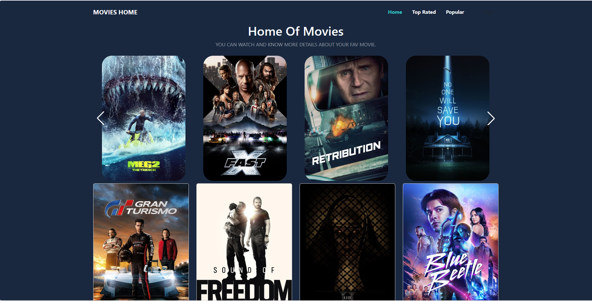
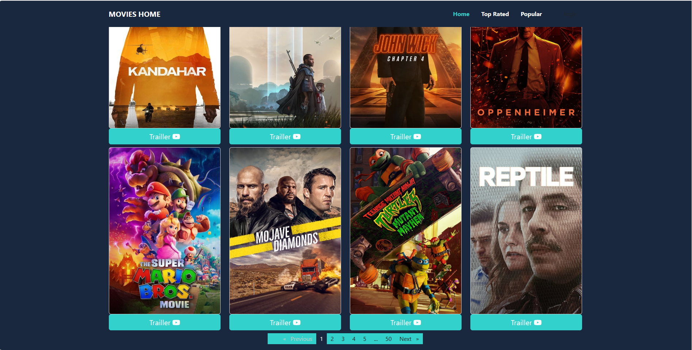
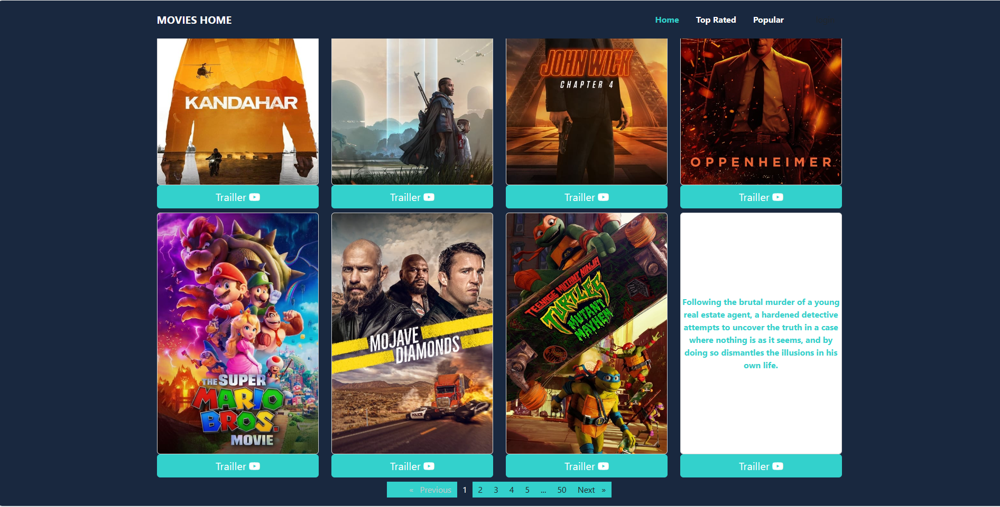
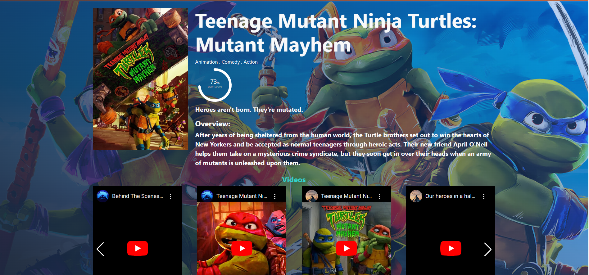

# Movies

This project was generated with [Angular CLI](https://github.com/angular/angular-cli) version 16.2.1.

## Live Demo
(https://movies-home-ng.netlify.app/)

## Dependencies

1- bootstrap 
2- bootstrap-icons 
3- ng-circle-progress 
4- ngx-pagination 
5- swiper 

## Clone this repo to your devcie then run " npm install " to install dependencies

## Run `ng serve` for a dev server. Navigate to `http://localhost:4200/`.

